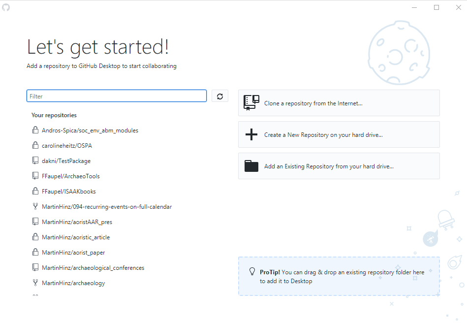
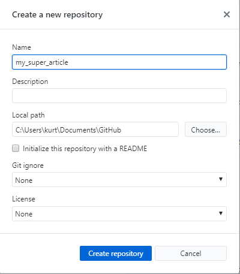
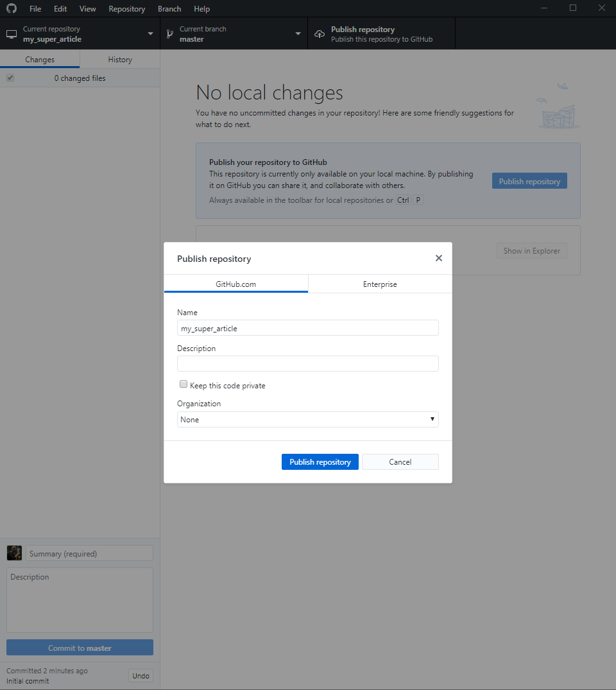
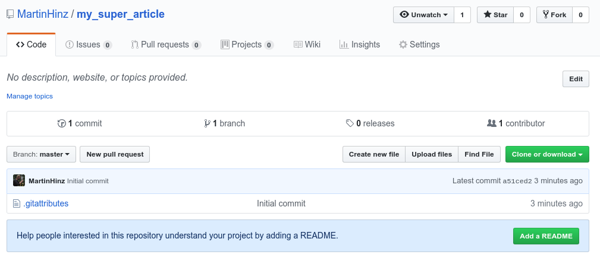
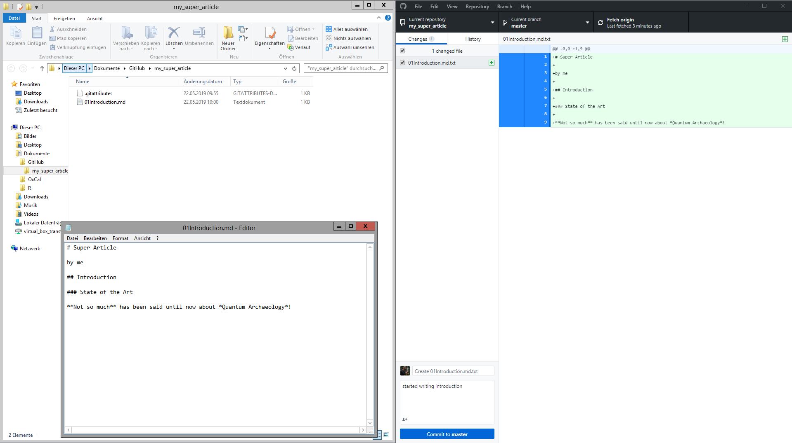
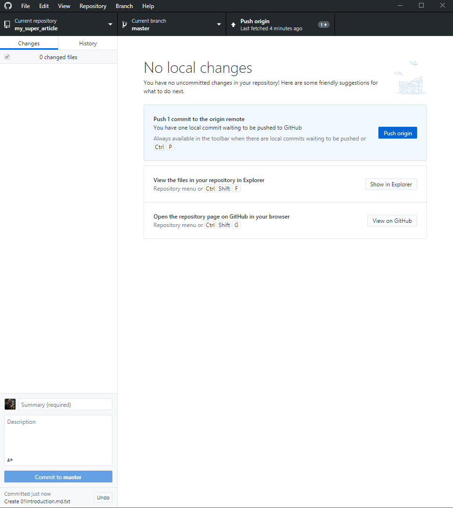
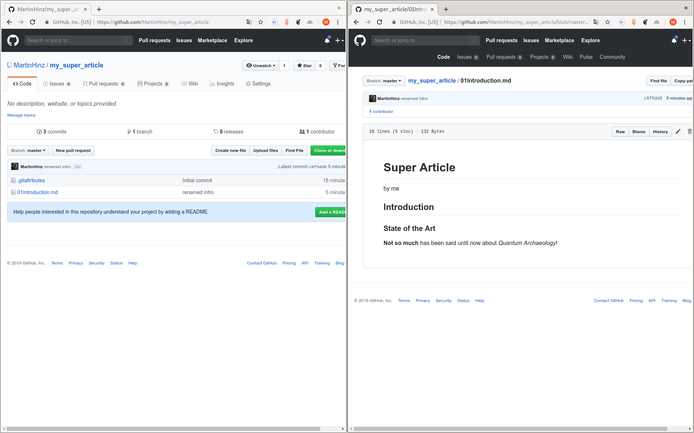
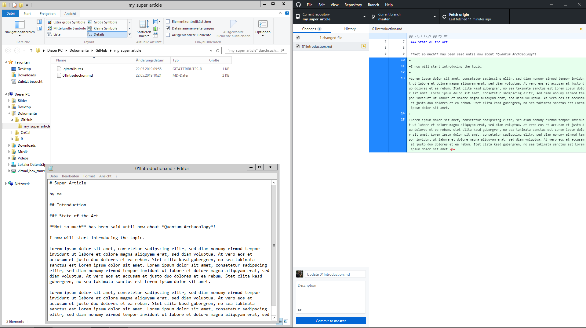
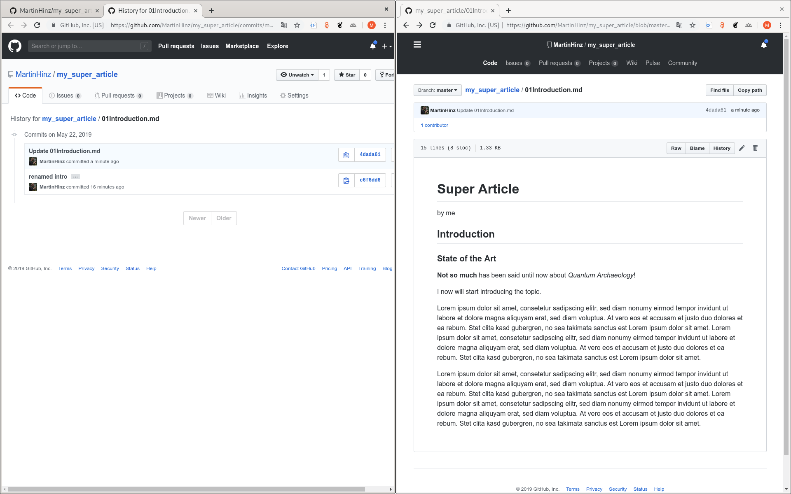

<link rel="stylesheet" href="./assets/css/style.css">
<link rel="stylesheet" href="./assets/css/customize.css">
<link rel="stylesheet" href="./assets/css/default-fonts.css">

# Der Versionshölle entfliehen
## Github als Werkzeug in den Geisteswissenschaften

<!--s-->

## Inhalt

* was Versionskontrolle ist und warum sie nützlich sein kann
* wie Versionskontrolle beim akademischen Schreiben nützlich sein kann
* die Unterschiede zwischen Git und GitHub
* wie man Versionskontrolle mit GitHub Desktop, einer grafischen Benutzeroberfläche für GitHub, implementiert

<!--s-->

## Ausgangspunkt

<!-- .element height="50%" width="50%" -->

<!--s-->

Die meisten von uns benutzen eine Art Versionskontrollsystem für Dateien.

Oftmals geschieht dies durch das Speichern verschiedener Versionen der Dateien.

```
mydocument.docx
mydocumentversion2.docx
mydocumentwithrevision.docx
mydocumentfinal.docx
```

<!--s-->

Das System, das für die Benennung von Dateien verwendet wird, kann mehr oder weniger systematisch sein. Das Hinzufügen von Datumsangaben erleichtert die Verfolgung von Änderungen etwas:

```
mydocument2016-01-06.docx
mydocument2016-01-08.docx
```

<!--s-->

## Probleme

* Änderungen zwischen den Momentaufnahmen werden nicht erfasst
  * Einige enthalten vielleicht kleinere Tippfehlerbereinigungen, andere größere Umstrukturierungen
* Überblick über unterschiedliche parallele Entwicklungsstränge ist kaum möglich

<!--s-->

## Versionskontrolle
* systematischer Ansatz zur Erfassung und Verwaltung von Änderungen in Dateien
* im einfachsten Fall
  - Erstellung von "Snapshots" Ihrer Datei in verschiedenen Phasen
  - Informationen darüber auf, wann der Snapshot gemacht wurde
  - welche Änderungen zwischen verschiedenen Snapshots vorgenommen wurden
  - dies ermöglicht es, die Datei auf eine ältere Version zurückzuspulen

<!--s-->

## Wissenschaftliche Arbeit

* ist zunehmend an digitale Werkzeuge und Datenspeicherung gebunden
* findet häufig in Kollaboration statt
* Versionskontrolle direkt für diese Zwecke, vornehmlich für Programmcode entwickelt, aber:
  * es gibt viele Vorteile, die auch für Textdokumente sinnvoll sind
  * Wissenschaftlicher Text <-> Computercode

<!--s-->

## Vorteile von Versionskontrolle

* Verfolgen von Entwicklungen und Änderungen
* Erfassen von Änderungen, so dass diese später nachvollziehbar sind
* Experimentieren mit verschiedenen Versionen eines Dokuments unter Beibehaltung der Originalversion
* "Zusammenführen" zweier Versionen eines Dokuments
* Verwalten von Konflikten zwischen Versionen
* Wiederherstellen von Änderungen durch 'Rückspulen'

Versionskontrolle ist nicht für alle Dokumente erforderlich. Für umfangreiche Arbeiten wie Artikel, Bücher oder Dissertationen ist die Versionskontrolle jedoch sehr sinnvoll.

<!--s-->

## Was sind Git und GitHub?
* Oft synonym verwendet, **Git** und **GitHub** sind jedoch zwei verschiedene Dinge
  - **Git** ist eine spezielle Implementierung der Versionskontrolle, ursprünglich von Linus Torvalds zur Verwaltung des Linux-Quellcodes entwickelt (Es gibt andere Systeme der Versionskontrolle)
  - **GitHub** ist ein Unternehmen, das Git Repositories hostet. GitHub ist derzeit der beliebteste Host von Open-Source-Projekten, wurde allerdings von Microsoft übernommen

<!--s-->

## Warum nicht Dropbox oder Google Drive verwenden?
Dropbox, Google Drive und andere Dienste bieten auch eine Art Versionskontrolle an. Dies kann ausreichen. Ein Versionskontrollsystems wie Git hat jedoch Vorteile:

- **Sprachunterstützung**: Git unterstützt sowohl Text als auch Programmiersprachen.
  - digitale Techniken und Werkzeuge immer wichtiger, daher sinnvoll, sowohl die "traditionellen" Formen (Zeitschriftenartikel, Bücher usw.) als auch neueren (Code, Datensätze usw.) zu verwalten und zu teilen
- **Mehr Kontrolle**: Eine korrekte Versionskontrolle gibt Ihnen eine viel größere Kontrolle darüber, wie Sie Änderungen in einem Dokument verwalten.
- **Nützliche Historie**: Die Verwendung von Versionskontrollsystemen wie Git ermöglicht es Ihnen, eine Historie Ihres Dokuments zu erstellen

<!--s-->

## Textdokumente

Versionskontrollsysteme wie Git funktionieren am besten mit reinen Textdateien.

**Vorteile**:
- 'Portabilität': Sie funktionieren auf fast jedem Computer

**Nachteil**:
- Eingeschränkte Formatierungsmöglichkeiten

**Markdown**:
- Eine einfache Formatierungssprache für Textdateien
  - Überschriften/Fettung/Kursiv/Links sind möglich
  - Mit Zusatzelementen Literaturverwaltung einbaubar
- [Grundlegende Einführung](https://programminghistorian.org/en/lessons/getting-started-with-markdown)
- [Wissenschaftliches Schreiben](https://programminghistorian.org/en/lessons/sustainable-authorship-in-plain-text-using-pandoc-and-markdown)

<!--s-->

## GitHub Account

Da wir GitHub verwenden werden, müssen wir uns für ein Konto bei [GitHub](https://github.com/) registrieren, wenn wir noch kein Konto haben. Für [Studierende](https://education.github.com/pack) und [Forschende](https://github.blog/2014-05-14-improving-github-for-science/) bietet GitHub kostenlose private Repositorien an. Diese sind nicht notwendig, können aber interessant sein, wenn Sie etwas von Ihrer Arbeit vertraulich behandeln wollen.

<!--s-->
## GitHub Desktop
GitHub Desktop ermöglicht es, die Versionskontrolle einfach zu benutzen. GitHub Desktop bietet eine grafische Benutzeroberfläche (GUI) zur Verwendung von Git.

<!-- .element: class="pull-left" -->
<div class="pull-right">
(Coole Frauen und Männer ohne Unterwäsche benutzen die Kommandozeile...)
<pre>
<code class="hljs stylus">git status
git add .
git commit -m "added link to github desktop"
git push</code>
</pre>
</div>

Sie können [GitHub Desktop hier herunterladen](https://desktop.github.com/). Während des Starts wird zum Einloggen in Ihr GitHub-Konto aufgefordert.

<!--s-->

## GitHub Desktop starten



<!--s-->

## Neues Repository erstellen



<!--s-->

## Repository veröffentlichen

<!-- .element: class="pull-left" -->

<!-- .element: class="pull-right" -->

<!--s-->

## Workflow

- Pull
- Edit
- Commit
- Push

<!--s-->

## Text Datei anlegen und Committen

<!-- .element: class="pull-left" -->

<!-- .element: class="pull-right" -->

<!--s-->

## Commit pushen

<!-- .element: class="pull-left" -->

<!-- .element: class="pull-right" -->

<!--s-->

## Neu editieren, committen und pushen

<!-- .element: class="pull-left" -->

<!-- .element: class="pull-right" -->

<!--s-->

## History


<!--s-->
## Branching


<!--s-->
## Weitere Themen

- [Konfliktlösung](https://programminghistorian.org/en/lessons/getting-started-with-github-desktop#managing-conflicts)
- [Pull Requests](https://help.github.com/en/articles/about-pull-requests)
- [Github Pages](https://pages.github.com/)
- Präsentationen
  - Diese Präsentation wurde mit Git und Github erstellt
  - Repo: [https://github.com/MartinHinz/humanities_github](https://github.com/MartinHinz/humanities_github)
  - Präsentation: [https://martinhinz.github.io/humanities_github](https://martinhinz.github.io/humanities_github)

<!--v-->
# References

* Basis dieser Einführung: [The Programming Historian](https://programminghistorian.org/en/lessons/getting-started-with-github-desktop#managing-conflicts)
* Spiel-Repo dieser Einführung: []()
* [Git](https://git-scm.com/)
* [git - Der einfache Einstieg](https://rogerdudler.github.io/git-guide/index.de.html)
* [GitHub](https://github.com/)
* [GitHub Pages](https://pages.github.com)
