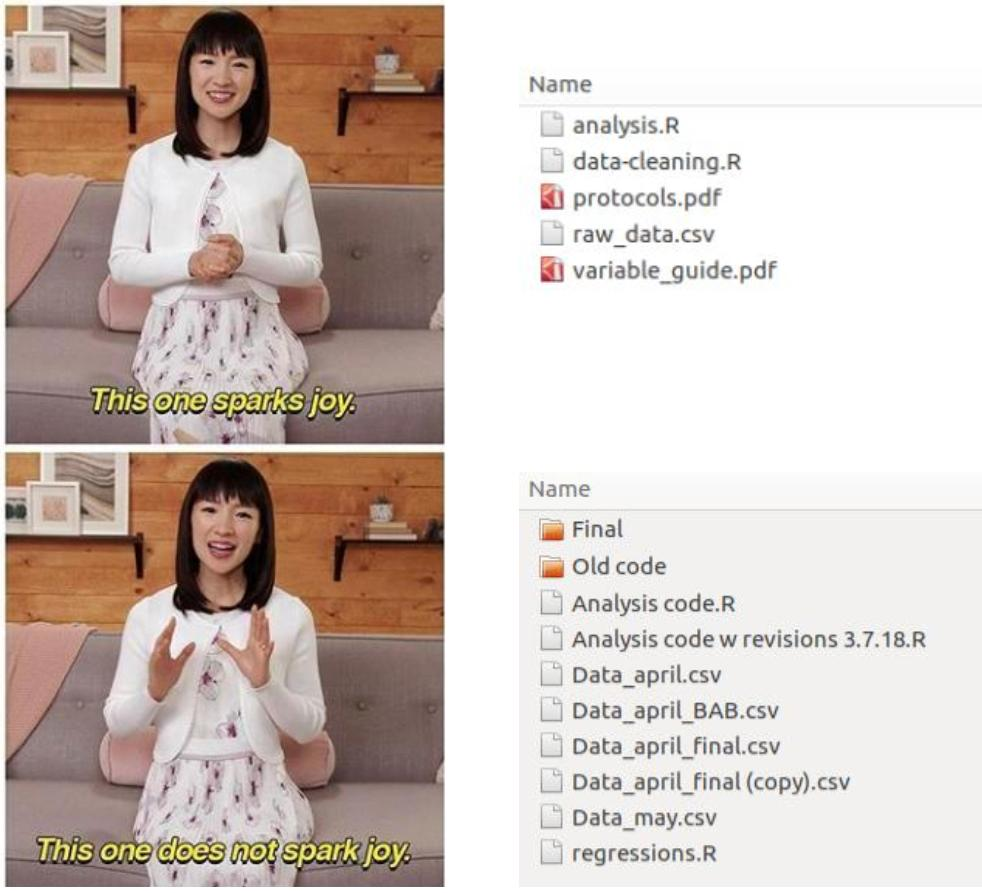

<link rel="stylesheet" href="css/style.css" id="theme">
<link rel="stylesheet" href="css/customize.css" id="theme">
<link rel="stylesheet" href="css/default-fonts.css" id="theme">

# Inhalt

* was Versionskontrolle ist und warum sie nützlich sein kann
* wie Versionskontrolle beim akademischen Schreiben nützlich sein kann
* die Unterschiede zwischen Git und GitHub
* wie man Versionskontrolle mit GitHub Desktop, einer grafischen Benutzeroberfläche für GitHub, implementiert

<!--s-->

# Ausgangspunkt

<!-- .element height="50%" width="50%" -->

<!--s-->

Die meisten von uns benutzen eine Art Versionskontrollsystem für Dateien.

Oftmals geschieht dies durch das Speichern verschiedener Versionen der Dateien.

```
mydocument.docx
mydocumentversion2.docx
mydocumentwithrevision.docx
mydocumentfinal.docx
```

<!--s-->

Das System, das für die Benennung von Dateien verwendet wird, kann mehr oder weniger systematisch sein. Das Hinzufügen von Datumsangaben erleichtert die Verfolgung von Änderungen etwas:

```
mydocument2016-01-06.docx
mydocument2016-01-08.docx
```

<!--s-->

## Probleme

* Änderungen zwischen den Momentaufnahmen werden nicht erfasst
  * Einige enthalten vielleicht kleinere Tippfehlerbereinigungen, andere größere Umstrukturierungen
* Überblick über unterschiedliche parallele Entwicklungsstränge ist kaum möglich

<!--s-->

## Versionskontrolle
* systematischer Ansatz zur Erfassung und Verwaltung von Änderungen in Dateien
* im einfachsten Fall
  - Erstellung von "Snapshots" Ihrer Datei in verschiedenen Phasen
  - Informationen darüber auf, wann der Snapshot gemacht wurde
  - welche Änderungen zwischen verschiedenen Snapshots vorgenommen wurden
  - dies ermöglicht es, die Datei auf eine ältere Version zurückzuspulen

<!--s-->

## Wissenschaftliche Arbeit

* ist zunehmend an digitale Werkzeuge und Datenspeicherung gebunden
* findet häufig in Kollaboration statt
* Versionskontrolle direkt für diese Zwecke, vornehmlich für Programmcode entwickelt, aber:
  * es gibt viele Vorteile, die auch für Textdokumente sinnvoll sind
  * Wissenschaftlicher Text <-> Computercode

<!--s-->

## Vorteile von Versionskontrolle

* Verfolgen von Entwicklungen und Änderungen
* Erfassen von Änderungen, so dass diese später nachvollziehbar sind
* Experimentieren mit verschiedenen Versionen eines Dokuments unter Beibehaltung der Originalversion
* "Zusammenführen" zweier Versionen eines Dokuments
* Verwalten von Konflikten zwischen Versionen
* Wiederherstellen von Änderungen durch 'Rückspulen'

Versionskontrolle ist nicht für alle Dokumente erforderlich. Für umfangreiche Arbeiten wie Artikel, Bücher oder Dissertationen ist die Versionskontrolle jedoch sehr sinnvoll.

<!--s-->

## Was sind Git und GitHub?
* Oft synonym verwendet, **Git** und **GitHub** sind jedoch zwei verschiedene Dinge
  - **Git** ist eine spezielle Implementierung der Versionskontrolle, ursprünglich von Linus Torvalds zur Verwaltung des Linux-Quellcodes entwickelt (Es gibt andere Systeme der Versionskontrolle)
  - **GitHub** ist ein Unternehmen, das Git Repositories hostet. GitHub ist derzeit der beliebteste Host von Open-Source-Projekten, wurde allerdings von Microsoft übernommen

<!--s-->

## Warum nicht Dropbox oder Google Drive verwenden?
Dropbox, Google Drive und andere Dienste bieten auch eine Art Versionskontrolle an. Dies kann ausreichen. Ein Versionskontrollsystems wie Git hat jedoch Vorteile:

- **Sprachunterstützung**: Git unterstützt sowohl Text als auch Programmiersprachen.
  - digitale Techniken und Werkzeuge immer wichtiger, daher sinnvoll, sowohl die "traditionellen" Formen (Zeitschriftenartikel, Bücher usw.) als auch neueren (Code, Datensätze usw.) zu verwalten und zu teilen
- **Mehr Kontrolle**: Eine korrekte Versionskontrolle gibt Ihnen eine viel größere Kontrolle darüber, wie Sie Änderungen in einem Dokument verwalten.
- **Nützliche Historie**: Die Verwendung von Versionskontrollsystemen wie Git ermöglicht es Ihnen, eine Historie Ihres Dokuments zu erstellen

<!--v-->


# References

* [reveal-md](https://github.com/webpro/reveal-md)
* [reveal.js](http://lab.hakim.se/reveal-js)
* [GitHub Pages](https://pages.github.com)
* [Travis CI](https://travis-ci.org)
* [This template](https://github.com/martinmurphy/slidestemplate)
